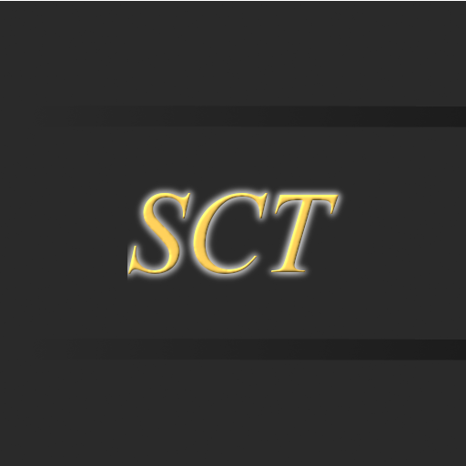

<h1 align = "center">Skyblock Collection Tracker - Fabric</h1>

  

---

## Installation

1. Download the latest version from [here](https://github.com/ChindeaYTB/SkyblockCollectionTracker-fabric/releases).
2. Add the mod to your mods folder (`.minecraft/mods`).
3. Make sure you have the [Fabric API](https://modrinth.com/mod/fabric-api/versions) and [Fabric Language Kotlin](https://modrinth.com/mod/fabric-language-kotlin) in your Minecraft mods folder.
4. Run Minecraft with the [Fabric installer](https://fabricmc.net/use/installer/) selected.
5. Use `/sct help` to get started.

---

## Features

<strong>Collection/Profit Tracker</strong>

- Tracks collections and profit over time using Hypixel’s API.
- Uses Bazaar Instant Sell/Buy prices.
- Configurable overlay lines showing collection progress and profit rates.
- Optional Sack Tracking mode for faster live updates.
- Detailed session summary (best/worst rates, elapsed time, profit, etc.).
- AFK detection stops tracking when idle.
- Use `/sct collection` to list available collections.

<strong>Skill Tracker</strong>

- Tracks all skills, displaying current XP, level, and rates.
- Uses Hypixel’s API for non‑maxed skills; live in‑game XP messages for maxed skills.
- Additional tracking for Taming.

<strong>Mining Stats Overlay</strong>

- Shows all mining‑related stats from tab.
- Updates dynamically based on the targeted block.
- Compacts Mining Fortune into a single context‑aware stat.

<strong>Commissions Overlay and Claim Buttons</strong>

- Displays active commissions and progress from tab data.
- Keybinds for quick commission claiming.

---

## Credits

All credits can be found [here](CREDITS.md).

---