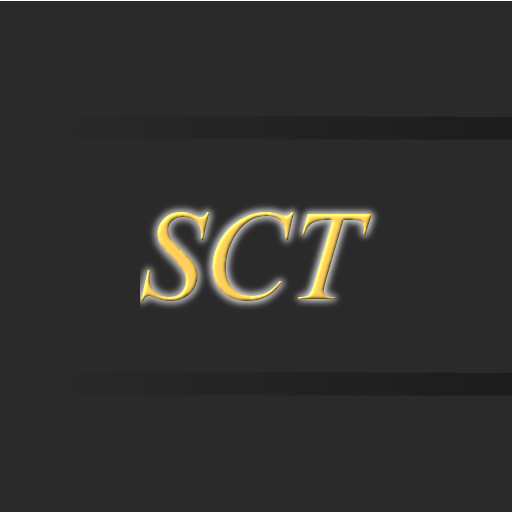

<h1 align = "center">
    Skyblock Collection Tracker - Fabric
</h1>

  

  
  
  

---

## Installation

1. Download the latest version from [here](https://github.com/ChindeaYTB/SkyblockCollectionTracker-fabric/releases).
2. Add the mod to your mods folder (`.minecraft/mods`).
3. Make sure you have the [Fabric API](https://modrinth.com/mod/fabric-api/versions) and [Fabric Language Kotlin](https://modrinth.com/mod/fabric-language-kotlin) in your Minecraft mods folder.
4. Run Minecraft with the [Fabric installer](https://fabricmc.net/use/installer/) selected.
5. Access the config GUI using `/sct`.
6. View all available commands with `/sct commands`.

---

## Features

<strong>Collection & Profit Tracker</strong>

- Tracks collection progress and profit using sack messages, via `/sct track <collection>`.
- Supports multi-tracking via `/sct track <collection1> <collection2> ...`.
- Provides an option to track via Hypixel's API instead of sacks.
- Configurable overlay lines showing collection progress and profit rates.
- Supports both NPC and Bazaar prices for profit calculations.
- Detailed session summary at the end (best/worst rates, elapsed time, profit, etc.).
- Provides leaderboard tracking for all collections, with data from Elite API.
- `/sct collections` for all available collections.

<strong>Skill Tracker</strong>

- Tracks all skills, displaying current XP, level, and rates.
- Uses Hypixel’s API for non‑maxed skills; live in‑game XP messages for maxed skills.
- Additional tracking for Taming.

<strong>Coleweight Modern</strong>

- Ported commands like `/sct cw find` or `/sct cw lb`, as well as `/sct cw detailed` for more info.
- Ported Coleweight chat ranks and the option to display them on Mining Islands only.
- Ported Dwarven Heatmap, with adjustable opacity.
- Ported Precision Mining highlight.
- Ported `/sct timer <set|pause|resume|stop>` command.
- Ported `/sct stopwatch <start|pause|resume|stop>` command.
- Tracks Coleweight with `/sct cw track`.

<strong>Farming Weight</strong>

- Provides commands like `/sct fw find` and `/sct fw lb` to access farming weight data from Elite API.
- Displays farming weight rank in chat for the top 1000 players, with customizable rank colors.

<strong>Mining/Foraging Stats Overlay</strong>

- Shows all mining/foraging‑related stats from the tab.
- Updates dynamically based on the targeted block.
- Compacts Fortune into a single context‑aware stat.

<strong>Commissions Overlay and Claim Buttons</strong>

- Displays active commissions and progress from tab data.
- Title notifications for completed and new commissions.
- Toggleable commission tracking.
- Keybinds for quick commission claiming.

<strong>Better Pickaxe/Axe Ability Cooldown</strong>

- Shows current pickaxe/axe ability and remaining duration while active.
- Cooldown updates live based on COTM/COTF, drill parts, and pet swaps.
- Configurable title alert when the ability is ready or expired.
- Configurable indicators for ability duration and cooldown.

<strong>Better Sky Mall/Lottery/Beekeeper</strong>

- Shows current Sky Mall/Lottery/Beekeeper buffs and their remaining time.
- Compacts chat messages.
- Option to show overlays only in Mining/Foraging Islands.

<strong>Mining Deployable Tracker</strong>

- Displays the lantern type and remaining duration while you're in range.
- Configurable title alert when the deployable has expired and out of range.

<strong>Mining Routes</strong>

- Displays ordered waypoints in mineshafts, only for jasper and crystal mineshafts.
- Displays ordered waypoints for mineshaft spawning routes.
- Displays ordered waypoints for dwarven metal and pure ore routes.
- All routes used are from Mining Cult.

<strong>Temporary Buff Tracker</strong>

- Tracks temporary mining buffs like refined dark cacao truffle or filet o' fortune.

---

## Documentation

- [FAQ](FAQ.md)
- [Credits](CREDITS.md)

---
